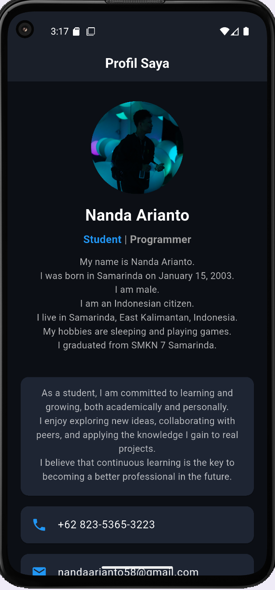
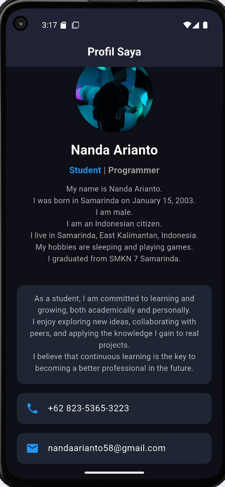
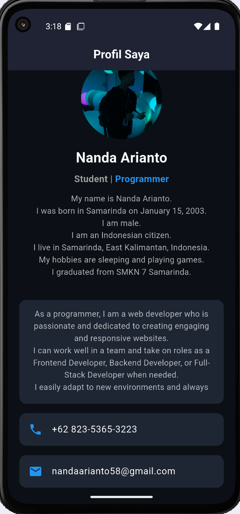

# ProfileApp - Aplikasi Profil Mobile (Flutter)

## 📖 Deskripsi
ProfileApp adalah aplikasi mobile sederhana untuk menampilkan profil pengguna.  
Aplikasi ini menampilkan informasi dasar pengguna dan deskripsi per role secara interaktif.  

**Fitur utama:**
- Menampilkan informasi profil.
- Tampilan modern dengan **tema gelap**.
- Foto profil berbentuk lingkaran (CircleAvatar).
- **Card deskripsi role yang dapat di-swipe** menggunakan **PageView**.
- Deskripsi panjang dapat **di-scroll** di dalam Card.
- Navigasi role interaktif dengan highlight untuk role aktif.

---

## 🖼 Tampilan Aplikasi

### 1. Halaman Utama


### 2. Deskripsi Role (Interaktif)
**Swipe atau klik label role untuk berpindah. Scroll jika teks panjang.**

| Student | Programmer |
|---------|------------|
|  |  |

> Dengan PageView, pengguna bisa **swipe antar role**, dan untuk konten yang panjang, teks **dapat di-scroll di dalam Card**.

---

## ⚙️ Teknologi yang Digunakan
- Flutter & Dart
- Android Studio / Visual Studio Code
- GitHub

---

## 🚀 Cara Menjalankan Aplikasi
**1. Clone repositori**
```bash
git clone https://github.com/nandaarianto15/ProfileApp.git
```
  
**2. Masuk ke folder proyek**
```bash
cd ProfileApp
```
**3. Jalankan aplikasi di emulator atau device**
```bash
flutter pub get
flutter run
```

---


## 📫 Kontak / Reach Me
Jika ingin berhubungan, kamu bisa menghubungi saya melalui:

- 🔗 **LinkedIn:** [Nanda Arianto](https://www.linkedin.com/in/nanda-arianto-0133a6290/)  
- 📸 **Instagram:** [@nandaarianto_](https://www.instagram.com/nandaarianto_/)  
- 📘 **Facebook:** [Nanda Arianto](https://www.facebook.com/NandaArianto15?locale=id_ID)

> Saya terbuka untuk diskusi, pertanyaan, maupun kolaborasi.
